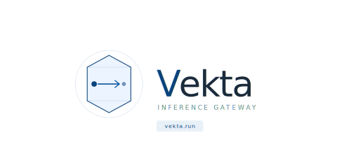

# Vekta

> Lightweight AI inference gateway with SSE streaming, SQLite cache, and Ollama backend.

```
vekta/
├── cmd/server/main.go          # Entry point, graceful shutdown
├── internal/
│   ├── api/                    # HTTP handlers, SSE streaming
│   ├── chat/                   # Session manager, context window
│   ├── cache/                  # SQLite persistent cache
│   ├── model/                  # OllamaClient, stream interface
│   └── config/                 # JSON config + env loader
├── configs/app.json            # Runtime config
└── go.mod
```

## Quick start

```bash
# Install Ollama dan pull model
ollama pull qwen2.5:0.5b

# Build
CGO_ENABLED=1 go build -o vekta ./cmd/server/

# Run
./vekta
```

## Config

Edit `configs/app.json` or override via env:

| Env | Default | Description |
|-----|---------|-------------|
| `OLLAMA_HOST` | `127.0.0.1:11434` | Ollama server address |
| `MEMORY_LIMIT_MB` | `3200` | Hard memory ceiling |
| `SQLITE_PATH` | `./cache/chat.db` | Cache database path |

## API

```
POST /v1/chat/stream   — SSE streaming chat
GET  /health           — Health check
```

### Request
```json
{
  "model": "qwen2.5:0.5b",
  "messages": [
    { "role": "user", "content": "Hello" }
  ]
}
```

### SSE Events
```
event: chunk   data: {"content": "Hi"}
event: done    data: {}
event: error   data: {"message": "..."}
```

## Termux / low-spec setup

```bash
pkg install clang golang
export CGO_ENABLED=1
go build -o vekta ./cmd/server/
OLLAMA_HOST=127.0.0.1:11434 MEMORY_LIMIT_MB=1024 ./vekta
```

Recommended model for <2GB RAM: `qwen2.5:0.5b`

---

**vekta** — vector + kata. Inference that goes somewhere.
# vekta
